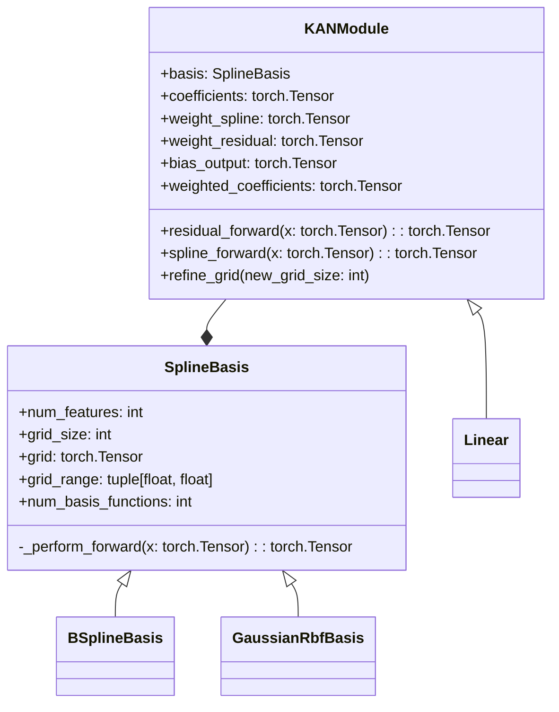

# Architecture

```mermaid
classDiagram

class SplineBasis {
    +num_features: int
    +grid_size: int
    +grid: torch.Tensor
    +grid_range: tuple[float, float]
    +num_basis_functions: int
    -_perform_forward(x: torch.Tensor): torch.Tensor
}

SplineBasis <|-- BSplineBasis
SplineBasis <|-- GaussianRbfBasis


class KANModule {
    +basis: SplineBasis
    +coefficients: torch.Tensor
    +weight_spline: torch.Tensor
    +weight_residual: torch.Tensor
    +bias_output: torch.Tensor
    +weighted_coefficients: torch.Tensor
    +residual_forward(x: torch.Tensor): torch.Tensor
    +spline_forward(x: torch.Tensor): torch.Tensor
    +refine_grid(new_grid_size: int)
}

KANModule --* SplineBasis

KANModule <|-- Linear

```